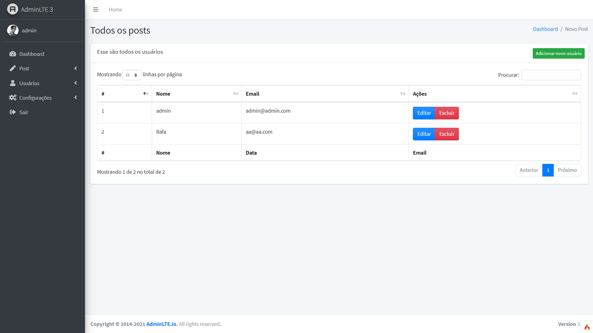

<h4 align="center">
    <br><br>
    <p align="center">
      <a href="#-about">About</a>&nbsp;&nbsp;&nbsp;|&nbsp;&nbsp;&nbsp;
      <a href="#-technologies">Technologies</a>&nbsp;&nbsp;&nbsp;|&nbsp;&nbsp;&nbsp;
      <a href="#-how-to-run-the-project">Run</a>&nbsp;&nbsp;&nbsp;|&nbsp;&nbsp;&nbsp;
      <a href="#-info">Info</a>&nbsp;&nbsp;&nbsp;|&nbsp;&nbsp;&nbsp;
      <a href="#-changelog">Changelog</a>&nbsp;&nbsp;&nbsp;|&nbsp;&nbsp;&nbsp;
      <a href="#-license">License</a>
  </p>
</h4>

<h1 align="center">
  
  <div style="display: flex; flex-direction: row;">
    
    
  <div>
</h1>
<h1 align="center">
  
  <div style="display: flex; flex-direction: row;">
    
    
  <div>
  <div style="display: flex; flex-direction: row;">
    
    
  <div>
  <div style="display: flex; flex-direction: row;">
    
    
  <div>
  <div style="display: flex; flex-direction: row;">
    
    
  <div>
  <div style="display: flex; flex-direction: row;">
    
    
  <div>
  <div style="display: flex; flex-direction: row;">
    
  <div>
</h1>

## 🔖 About
O Simple Blog é uma aplicação criado com codeigniter 4, permite o CRUD de noticias e conta com uma autenticação.

## 🚀 Technologies
- [PHP](https://php.net/)
- [CodeIgniter](https://codeigniter.com/)
- [AdminLTE](https://adminlte.io/)
- [DevBlog](https://themes.3rdwavemedia.com/bootstrap-templates/personal/devblog-free-bootstrap-4-blog-template-for-developers/)

## 🏁 How to run the project
#### Clone the repository
```bash
git clone https://github.com/rafinhaa/simple-blog.git
cd simple-blog
```

#### Install dependencies
```bash
composer install
```

#### Execute migrations
```bash
php spark migrate
```

#### Execute seeders
```bash
php spark db:seed UsersSeeder
```

## ℹ️ Info
#### Credentials
- Usuário: admin@admin.com
- Senha:   password

## 📄 Changelog
[See here](docs/changelog.md)

## 📝 License
[MIT](LICENSE)

**Free Software, Hell Yeah!**